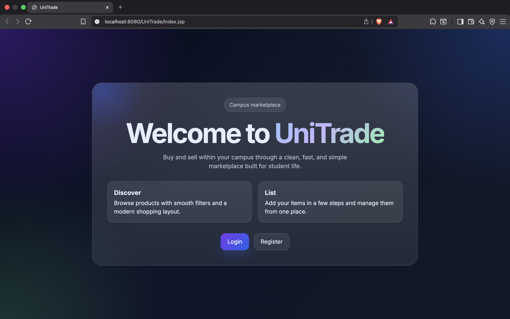
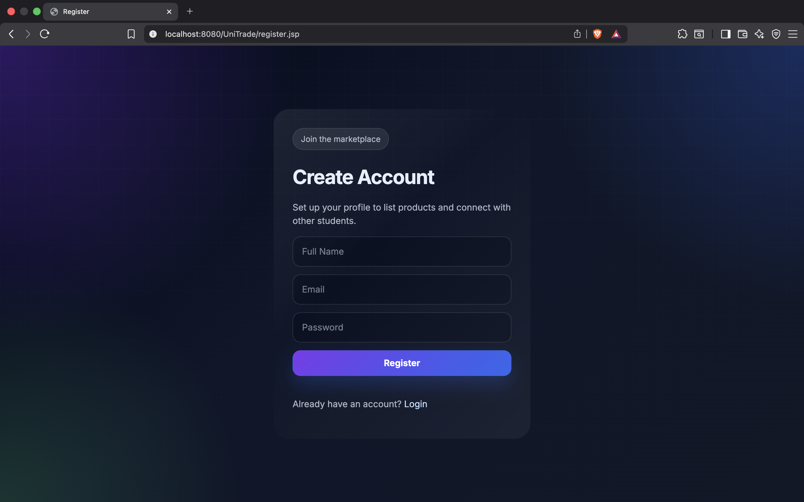
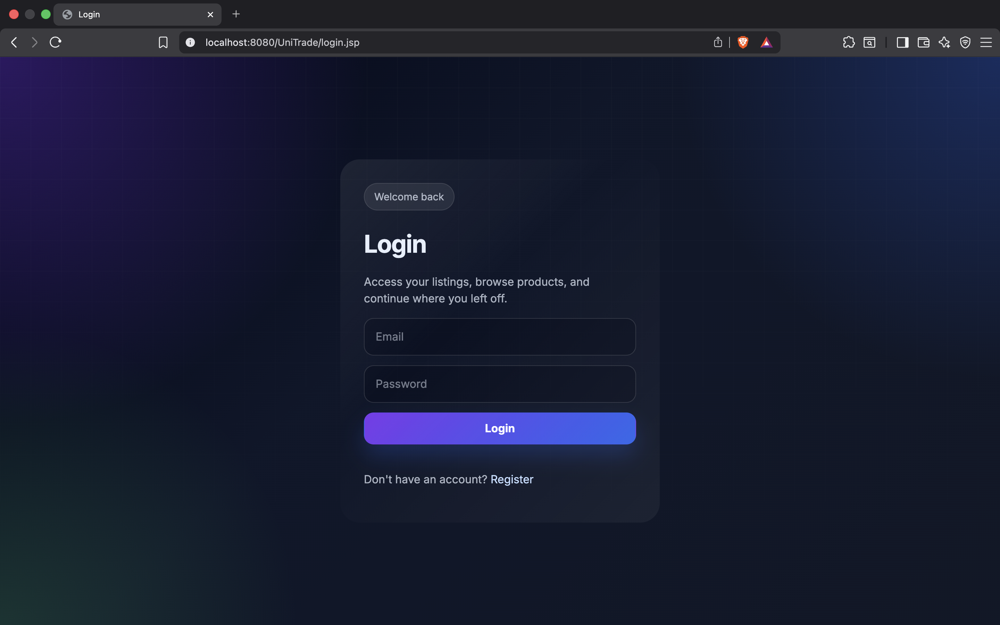
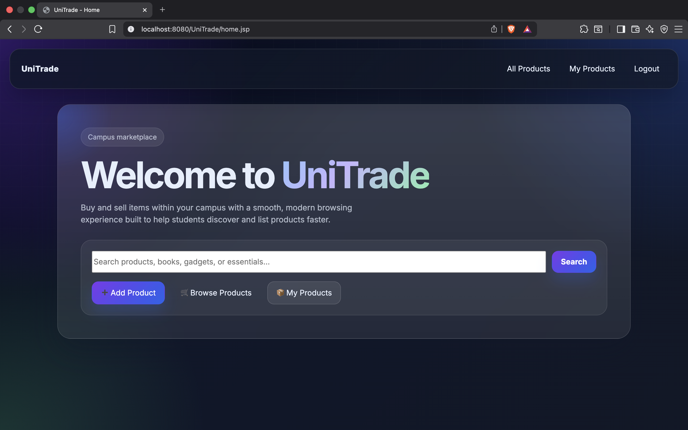
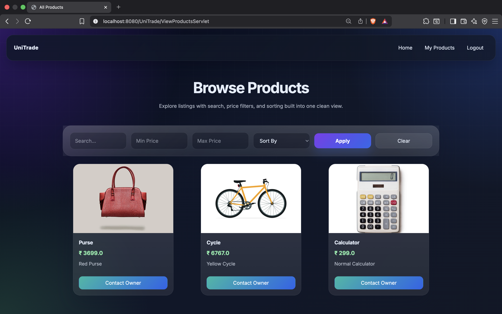
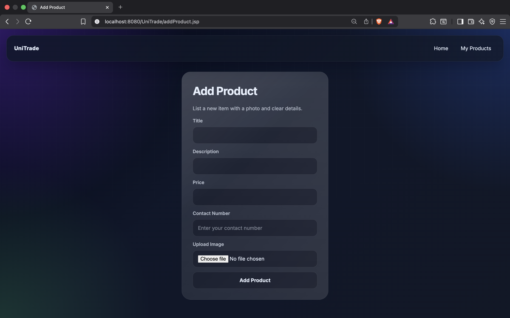
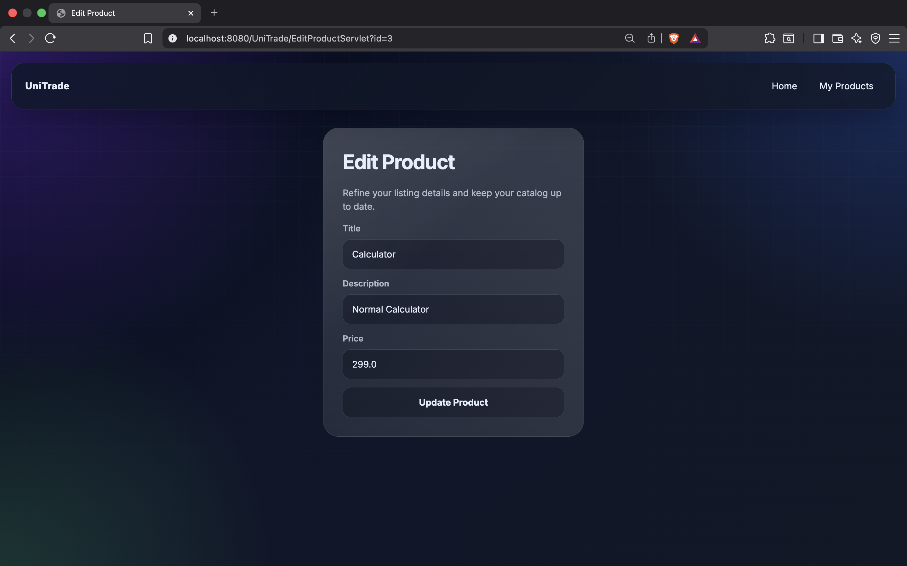
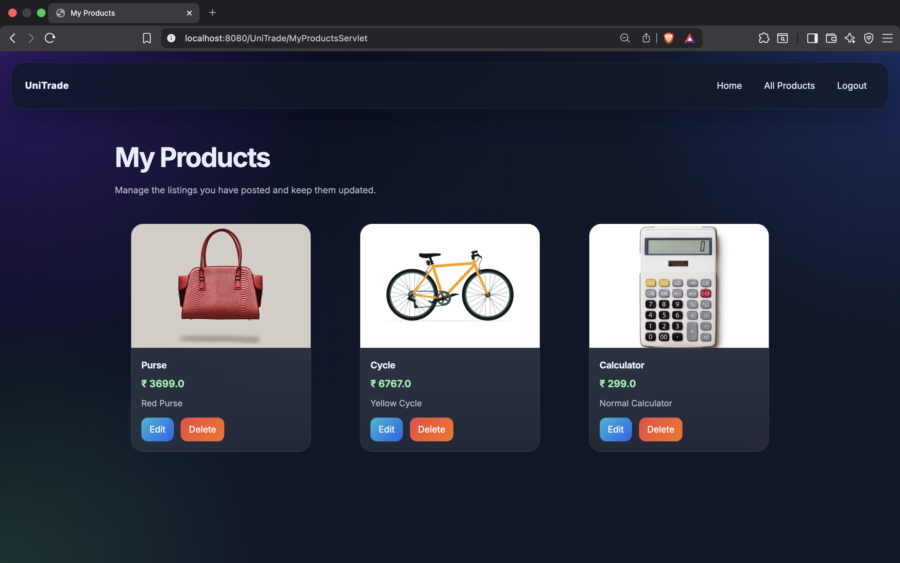

# 🏪 UniTrade - Campus Marketplace Platform

UniTrade is a modern **Java JSP/Servlet-based campus marketplace** where students can buy, sell, and trade items within their university community. Built with Jakarta Servlet API, MySQL, and deployed on Apache Tomcat, it provides a seamless peer-to-peer trading experience with an intuitive interface and robust admin controls.

---

## 📋 Table of Contents

- [🌟 Overview](#-overview)
- [✨ Features](#-features)
- [🛠️ Tech Stack](#-tech-stack)
- [📸 Screenshots](#-screenshots)
- [📦 Installation](#-installation)
- [🚀 Quick Start](#-quick-start)
- [📖 Usage Guide](#-usage-guide)
- [🏗️ Architecture](#-architecture)
- [🗄️ Database Schema](#-database-schema)
- [🔌 Servlet API Documentation](#-servlet-api-documentation)
- [📁 Project Structure](#-project-structure)
- [⚙️ Configuration](#-configuration)
- [🔧 Troubleshooting](#-troubleshooting)
- [🤝 Contributing](#-contributing)
- [📜 License](#-license)

---

## 🌟 Overview

UniTrade simplifies campus commerce by connecting students in a secure, community-focused marketplace. Whether you're selling textbooks, furniture, or electronics, or looking for a great deal on campus essentials, UniTrade makes it easy to find what you need.

**Key Statistics:**
- 📊 19 servlet endpoints for robust backend operations
- 🗄️ 3 main data models (Users, Products, Wishlist)
- 🎨 12+ responsive JSP pages for intuitive UI
- ⚡ Fast search & filtering across thousands of listings

---

## ✨ Features

### 🔐 Authentication & Access Control
- **User Registration:** Email-based signup with password validation
- **Secure Login:** Session-based authentication with encrypted credentials
- **Admin Roles:** Dedicated admin panel with elevated privileges
- **Logout:** Secure session termination

### 📦 Product Management
- **Create Listings:** Add products with:
  - Title, description, and detailed specifications
  - Price and condition (New, Like New, Good, Fair)
  - Product category and campus location
  - Contact information
  - Product images
- **Edit & Delete:** Manage your own listings
- **Mark as Sold:** Quick status updates for sold items
- **View All Products:** Browse entire catalog with pagination

### 🔍 Advanced Search & Filtering
- **Keyword Search:** Search across product titles and descriptions
- **Category Filtering:** Browse by product category
- **Condition Filtering:** Filter by item condition
- **Price Range:** Set minimum and maximum price filters
- **Campus Location:** Find items near you
- **Smart Sorting:** Order by price or title

### ❤️ Wishlist Management
- **Save Products:** Add items to personalized wishlist
- **Quick Access:** View all saved products on dedicated page
- **Remove Items:** Manage wishlist with one click
- **Save for Later:** Keep track of interested items

### 👨‍💼 Admin Dashboard
- **Analytics Overview:** Total users and products at a glance
- **Recent Activity:** Monitor recent users and product listings
- **User Management:** Review, inspect, and manage user accounts
- **Product Management:** Review, inspect, and manage product listings
- **Admin Controls:** Delete problematic users or listings

---

## 📸 Screenshots

### Landing Page


### User Registration


### User Login


### Home Dashboard


### Browse Products


### Add New Product


### Edit Product


### My Products (User Listings)


---

## 🛠️ Tech Stack

| Category | Technology | Version |
|----------|-----------|---------|
| **Backend** | Java, Jakarta Servlet API | Java 11+ |
| **Presentation** | JSP (JavaServer Pages) | 3.0+ |
| **Frontend** | HTML5, CSS3, JavaScript (Vanilla) | ES6+ |
| **Database** | MySQL | 8.0+ |
| **JDBC Driver** | MySQL Connector/J | 9.4.0 |
| **Application Server** | Apache Tomcat | 10.0+ |
| **IDE** | Eclipse IDE / IntelliJ IDEA | Latest |
| **Build Tool** | Maven | 3.6+ |
| **Protocol** | HTTP/HTTPS | HTTP/1.1 |

---

## 📦 Installation

### Prerequisites

Ensure you have the following installed on your system:

```bash
# Java Version Check
java -version
# Required: Java 11 or higher

# MySQL Version Check
mysql --version
# Required: MySQL 8.0 or higher

# Download Apache Tomcat 10.0+
# From: https://tomcat.apache.org/download-10.cgi
```

### Step 1: Clone/Download Project

```bash
# Navigate to your projects directory
cd ~/projects

# Clone the repository (if using git)
git clone https://github.com/yourusername/UniTrade.git
cd UniTrade
```

### Step 2: Set Up MySQL Database

#### Create Database and Tables

```sql
-- Connect to MySQL
mysql -u root -p

-- Create database
CREATE DATABASE IF NOT EXISTS unitrade;
USE unitrade;

-- Create users table
CREATE TABLE users (
    id INT AUTO_INCREMENT PRIMARY KEY,
    name VARCHAR(100) NOT NULL,
    email VARCHAR(100) UNIQUE NOT NULL,
    password VARCHAR(255) NOT NULL,
    phone VARCHAR(15),
    is_admin BOOLEAN DEFAULT FALSE,
    created_at TIMESTAMP DEFAULT CURRENT_TIMESTAMP
);

-- Create products table
CREATE TABLE products (
    id INT AUTO_INCREMENT PRIMARY KEY,
    user_id INT NOT NULL,
    title VARCHAR(200) NOT NULL,
    description TEXT,
    price DECIMAL(10, 2),
    image VARCHAR(255),
    contact_number VARCHAR(15),
    condition VARCHAR(50),
    category VARCHAR(100),
    campus_location VARCHAR(100),
    sold BOOLEAN DEFAULT FALSE,
    created_at TIMESTAMP DEFAULT CURRENT_TIMESTAMP,
    FOREIGN KEY (user_id) REFERENCES users(id) ON DELETE CASCADE
);

-- Create wishlist table
CREATE TABLE wishlist (
    id INT AUTO_INCREMENT PRIMARY KEY,
    user_id INT NOT NULL,
    product_id INT NOT NULL,
    saved_at TIMESTAMP DEFAULT CURRENT_TIMESTAMP,
    FOREIGN KEY (user_id) REFERENCES users(id) ON DELETE CASCADE,
    FOREIGN KEY (product_id) REFERENCES products(id) ON DELETE CASCADE,
    UNIQUE(user_id, product_id)
);

-- Create indexes for performance
CREATE INDEX idx_user_email ON users(email);
CREATE INDEX idx_product_user ON products(user_id);
CREATE INDEX idx_wishlist_user ON wishlist(user_id);
CREATE INDEX idx_wishlist_product ON wishlist(product_id);
```

### Step 3: Configure Database Connection

Edit `src/main/java/dao/DBConnection.java`:

```java
public static Connection getConnection() {
    Connection con = null;
    try {
        Class.forName("com.mysql.cj.jdbc.Driver");
        con = DriverManager.getConnection(
            "jdbc:mysql://localhost:3306/unitrade",
            "root",                // Change to your MySQL username
            "mysqlroot"            // Change to your MySQL password
        );
    } catch (Exception e) {
        e.printStackTrace();
    }
    return con;
}
```

### Step 4: Deploy to Apache Tomcat

#### Option A: Using Maven

```bash
# Build the project
mvn clean install

# Copy WAR file to Tomcat
cp target/UniTrade.war $CATALINA_HOME/webapps/

# Start Tomcat
$CATALINA_HOME/bin/startup.sh
```

#### Option B: Using Eclipse IDE

1. Right-click project → **Run As** → **Run on Server**
2. Select Apache Tomcat 10.0
3. Click **Finish**

#### Option C: Manual Deployment

1. Build the project (generate WAR file)
2. Copy WAR to `$CATALINA_HOME/webapps/`
3. Start Tomcat: `$CATALINA_HOME/bin/startup.sh`

### Step 5: Access the Application

```
http://localhost:8080/UniTrade
```

---

## 🚀 Quick Start

### For Users

1. **Register an Account**
   - Navigate to the registration page
   - Enter your name, email, and password
   - Verify your credentials
   - Log in with your account

2. **Add Your First Product**
   - Click "Add Product" from the home page
   - Fill in product details (title, price, condition, etc.)
   - Upload product image
   - Click "Post Listing"

3. **Browse & Search**
   - Use the search bar to find items
   - Apply filters (price, condition, location)
   - Click on product to view details and contact seller

4. **Manage Wishlist**
   - Save interesting products to your wishlist
   - View all saved items in one place
   - Remove items as needed

### For Admins

1. **Access Admin Dashboard**
   - Log in with admin account
   - Navigate to Admin Dashboard
   - View key statistics and recent activity

2. **Manage Users**
   - View all registered users
   - Inspect user profiles
   - Delete suspicious accounts if needed

3. **Manage Products**
   - View all product listings
   - Inspect product details
   - Remove inappropriate listings

---

## 📖 Usage Guide

### Authentication Flow

```
User Registration
       ↓
RegisterServlet validates input
       ↓
Credentials stored in MySQL
       ↓
       ↓
User Login
       ↓
LoginServlet validates credentials
       ↓
Session created (session ID stored)
       ↓
Redirect to Home Page
```

### Product Listing Flow

```
User adds product
       ↓
AddProductServlet → SaveProductServlet
       ↓
Image uploaded & validated
       ↓
Product data inserted into MySQL
       ↓
Redirect to MyProducts page
```

### Search & Filtering Flow

```
User performs search
       ↓
SearchServlet receives query parameters
       ↓
Filters applied (category, price, condition, location)
       ↓
Database query executed
       ↓
Results displayed with pagination
```

### Wishlist Flow

```
User saves product
       ↓
SaveProductServlet adds to wishlist table
       ↓
WishlistServlet retrieves all saved items
       ↓
Wishlist page displays with options to remove
```

---

## 🏗️ Architecture

### Model-View-Controller Pattern

```
┌─────────────────────────────────────────────────────┐
│                                                         │
│                    JSP Pages (Views)                    │
│        (index, login, register, home, etc.)            │
│                                                         │
└────────────────┬────────────────────────────────────┘
                 │
         HTTP Request/Response
                 │
┌────────────────▼────────────────────────────────────┐
│                                                         │
│          Servlet Controllers (19 Servlets)            │
│    (LoginServlet, AddProductServlet, etc.)            │
│                                                         │
└────────────────┬────────────────────────────────────┘
                 │
            Business Logic
                 │
┌────────────────▼────────────────────────────────────┐
│                                                         │
│          Model Classes (Data Objects)                  │
│          (Product, User objects)                       │
│                                                         │
└────────────────┬────────────────────────────────────┘
                 │
           JDBC Layer
                 │
┌────────────────▼────────────────────────────────────┐
│                                                         │
│          MySQL Database                                │
│   (users, products, wishlist tables)                  │
│                                                         │
└─────────────────────────────────────────────────────┘
```

### Component Interaction Diagram

```
┌──────────────┐
│  User/Admin  │
└──────┬───────┘
       │ HTTP
       ▼
┌──────────────────┐
│  Web Browser     │
└──────┬───────────┘
       │
       ▼
┌──────────────────────────────┐
│   Apache Tomcat Server       │
├──────────────────────────────┤
│ ┌────────────────────────┐   │
│ │  JSP Pages (View)      │   │
│ ├────────────────────────┤   │
│ │  19 Servlet Classes    │   │
│ │  (Controller Layer)    │   │
│ ├────────────────────────┤   │
│ │  Model Classes         │   │
│ │  (Business Logic)      │   │
│ └────────────────────────┘   │
└──────────────┬────────────────┘
               │ JDBC
               ▼
        ┌──────────────┐
        │   MySQL DB   │
        └──────────────┘
```

---

## 🗄️ Database Schema

### Users Table
```sql
┌─────────────────────────────────────┐
│ users                               │
├─────────────────────────────────────┤
│ id (PK)              INT             │
│ name                 VARCHAR(100)    │
│ email (UNIQUE)       VARCHAR(100)    │
│ password             VARCHAR(255)    │
│ phone                VARCHAR(15)     │
│ is_admin             BOOLEAN         │
│ created_at           TIMESTAMP       │
└─────────────────────────────────────┘
```

### Products Table
```sql
┌────────────────────────────────────────┐
│ products                               │
├────────────────────────────────────────┤
│ id (PK)              INT               │
│ user_id (FK)         INT               │
│ title                VARCHAR(200)      │
│ description          TEXT              │
│ price                DECIMAL(10, 2)    │
│ image                VARCHAR(255)      │
│ contact_number       VARCHAR(15)       │
│ condition            VARCHAR(50)       │
│ category             VARCHAR(100)      │
│ campus_location      VARCHAR(100)      │
│ sold                 BOOLEAN           │
│ created_at           TIMESTAMP         │
└────────────────────────────────────────┘
```

### Wishlist Table
```sql
┌──────────────────────────────────────┐
│ wishlist                             │
├──────────────────────────────────────┤
│ id (PK)              INT              │
│ user_id (FK)         INT              │
│ product_id (FK)      INT              │
│ saved_at             TIMESTAMP        │
│ UNIQUE(user_id, product_id)          │
└──────────────────────────────────────┘
```

### Relationships
- Users → Products (1:N)
- Users → Wishlist (1:N)
- Products → Wishlist (1:N)

---

## 🔌 Servlet API Documentation

### Authentication Servlets

#### LoginServlet
- **Path:** `/login`
- **Method:** POST
- **Parameters:** email, password
- **Response:** Redirect to home or back to login with error
- **Session:** Creates session with user_id

#### RegisterServlet
- **Path:** `/register`
- **Method:** POST
- **Parameters:** name, email, password, confirmPassword
- **Validation:** Email uniqueness, password confirmation
- **Response:** Redirect to login or back to register with error

#### LogoutServlet
- **Path:** `/logout`
- **Method:** GET
- **Response:** Clears session, redirects to index

### Product Servlets

#### AddProductServlet
- **Path:** `/addProduct`
- **Method:** GET
- **Response:** Displays add product form
- **Authentication:** Required

#### SaveProductServlet
- **Path:** `/saveProduct`
- **Method:** POST
- **Parameters:** title, description, price, image, contactNumber, condition, category, campusLocation
- **Response:** Redirect to myProducts or back to form with error
- **File Upload:** Handles image upload

#### ViewProductsServlet
- **Path:** `/viewProducts`
- **Method:** GET
- **Parameters:** (optional) search, category, condition, minPrice, maxPrice, sort
- **Response:** Displays all products with filters and search
- **Pagination:** Supports pagination

#### MyProductsServlet
- **Path:** `/myProducts`
- **Method:** GET
- **Response:** Displays user's own products
- **Authentication:** Required

#### EditProductServlet
- **Path:** `/editProduct`
- **Method:** GET
- **Parameters:** id
- **Response:** Displays edit form with current product data
- **Authentication:** Required (owner only)

#### UpdateProductServlet
- **Path:** `/updateProduct`
- **Method:** POST
- **Parameters:** id, title, description, price, image, contactNumber, condition, category, campusLocation
- **Response:** Redirect to myProducts or back to form with error
- **Authentication:** Required (owner only)

#### DeleteProductServlet
- **Path:** `/deleteProduct`
- **Method:** POST
- **Parameters:** id
- **Response:** Redirect to myProducts
- **Authentication:** Required (owner only)

#### MarkSoldServlet
- **Path:** `/markSold`
- **Method:** POST
- **Parameters:** id
- **Response:** Redirect to myProducts
- **Authentication:** Required (owner only)

### Search Servlets

#### SearchServlet
- **Path:** `/search`
- **Method:** GET
- **Parameters:** q (query), category, condition, minPrice, maxPrice, sort, campus
- **Response:** Displays search results with filters
- **Features:** Full-text search, multiple filters

### Wishlist Servlets

#### WishlistServlet
- **Path:** `/wishlist`
- **Method:** GET
- **Response:** Displays user's wishlist items
- **Authentication:** Required

#### SaveProductServlet (Wishlist Add)
- **Path:** `/saveProduct`
- **Method:** GET
- **Parameters:** productId
- **Response:** Adds product to wishlist, redirects back
- **Authentication:** Required

#### RemoveWishlistServlet
- **Path:** `/removeWishlist`
- **Method:** POST
- **Parameters:** productId
- **Response:** Removes from wishlist, redirects to wishlist page
- **Authentication:** Required

### Admin Servlets

#### AdminDashboardServlet
- **Path:** `/adminDashboard`
- **Method:** GET
- **Response:** Displays admin dashboard with statistics
- **Authentication:** Required (admin only)

#### AdminUsersServlet
- **Path:** `/adminUsers`
- **Method:** GET
- **Response:** Displays all users table
- **Authentication:** Required (admin only)

#### AdminProductsServlet
- **Path:** `/adminProducts`
- **Method:** GET
- **Response:** Displays all products table
- **Authentication:** Required (admin only)

#### AdminDeleteUserServlet
- **Path:** `/adminDeleteUser`
- **Method:** POST
- **Parameters:** userId
- **Response:** Deletes user and their products
- **Authentication:** Required (admin only)

#### AdminDeleteProductServlet
- **Path:** `/adminDeleteProduct`
- **Method:** POST
- **Parameters:** productId
- **Response:** Deletes product from system
- **Authentication:** Required (admin only)

---

## 📁 Project Structure

```
UniTrade/
├── README.md                          # Project documentation
├── pom.xml                            # Maven configuration
├── assets/
│   └── screenShots/                   # Application screenshots
│       ├── index.png
│       ├── login.png
│       ├── register.png
│       ├── home.png
│       ├── viewProducts.png
│       ├── addProduct.png
│       ├── editProduct.png
│       └── myProducts.png
└── UniTrade/
    └── src/
        └── main/
            ├── java/
            │   ├── dao/
            │   │   └── DBConnection.java              # Database connection pool
            │   ├── model/
            │   │   └── Product.java                   # Product data model
            │   ├── servlet/
            │   │   ├── AddProductServlet.java
            │   │   ├── AdminDashboardServlet.java
            │   │   ├── AdminDeleteProductServlet.java
            │   │   ├── AdminDeleteUserServlet.java
            │   │   ├── AdminProductsServlet.java
            │   │   ├── AdminUsersServlet.java
            │   │   ├── DeleteProductServlet.java
            │   │   ├── EditProductServlet.java
            │   │   ├── LoginServlet.java
            │   │   ├── LogoutServlet.java
            │   │   ├── MarkSoldServlet.java
            │   │   ├── MyProductsServlet.java
            │   │   ├── RegisterServlet.java
            │   │   ├── RemoveWishlistServlet.java
            │   │   ├── SaveProductServlet.java
            │   │   ├── SearchServlet.java
            │   │   ├── UpdateProductServlet.java
            │   │   ├── ViewProductsServlet.java
            │   │   └── WishlistServlet.java
            │   └── util/
            │       └── AdminUtility.java               # Admin utilities
            └── webapp/
                ├── index.jsp                           # Landing page
                ├── login.jsp                           # Login page
                ├── register.jsp                        # Registration page
                ├── home.jsp                            # User home
                ├── viewProducts.jsp                    # Product listing
                ├── addProduct.jsp                      # Add product form
                ├── editProduct.jsp                     # Edit product form
                ├── myProducts.jsp                      # User's products
                ├── wishlist.jsp                        # Wishlist page
                ├── adminDashboard.jsp                  # Admin dashboard
                ├── adminUsers.jsp                      # User management
                ├── adminProducts.jsp                   # Product management
                ├── css/
                │   └── style.css                       # Styling
                ├── js/
                │   └── script.js                       # Client-side logic
                └── WEB-INF/
                    └── web.xml                         # Deployment descriptor
```

### File Breakdown

| Component | Count | Purpose |
|-----------|-------|---------|
| Servlets | 19 | Request handling and business logic |
| JSP Pages | 12 | UI rendering and user interaction |
| Models | 1 | Data representation (Product class) |
| DAOs | 1 | Database connection management |
| Utilities | 1 | Admin helper functions |

---

## ⚙️ Configuration

### web.xml Configuration

The `WEB-INF/web.xml` contains servlet mappings:

```xml
<servlet>
    <servlet-name>LoginServlet</servlet-name>
    <servlet-class>servlet.LoginServlet</servlet-class>
</servlet>
<servlet-mapping>
    <servlet-name>LoginServlet</servlet-name>
    <url-pattern>/login</url-pattern>
</servlet-mapping>
<!-- ... more mappings ... -->
```

### Database Configuration

**File:** `src/main/java/dao/DBConnection.java`

```java
public static Connection getConnection() {
    // Database credentials
    String url = "jdbc:mysql://localhost:3306/unitrade";
    String username = "root";
    String password = "mysqlroot";  // ⚠️ Change this!
    
    // Connection logic
    Class.forName("com.mysql.cj.jdbc.Driver");
    return DriverManager.getConnection(url, username, password);
}
```

### Environment Variables (Optional)

For security, consider using environment variables:

```bash
export DB_HOST=localhost
export DB_PORT=3306
export DB_NAME=unitrade
export DB_USER=root
export DB_PASS=mysqlroot
```

### Session Configuration

Sessions are configured in JSP pages:

```jsp
<% 
    HttpSession session = request.getSession();
    // Session timeout: 30 minutes (configurable)
%>
```

---

## 🔧 Troubleshooting

### Common Issues & Solutions

#### 1. Database Connection Failed
**Error:** `java.sql.SQLException: No suitable driver found`

**Solutions:**
- Verify MySQL JDBC driver is in classpath
- Check MySQL server is running: `mysql -u root -p`
- Verify credentials in `DBConnection.java`
- Ensure database `unitrade` exists

```bash
# Check MySQL running
ps aux | grep mysqld

# Restart MySQL (macOS)
brew services restart mysql

# Restart MySQL (Linux)
sudo systemctl restart mysql
```

#### 2. Tomcat Startup Failures
**Error:** `CATALINA_HOME not set` or port already in use

**Solutions:**
```bash
# Set CATALINA_HOME
export CATALINA_HOME=/path/to/tomcat

# Check if port 8080 is in use
lsof -i :8080

# Kill process on port 8080
kill -9 <PID>

# Try different port (edit catalina.sh if needed)
```

#### 3. JSP Pages Not Rendering
**Error:** Blank page or 404 errors

**Solutions:**
- Check Tomcat logs: `$CATALINA_HOME/logs/catalina.out`
- Verify WAR deployment: `ls $CATALINA_HOME/webapps/`
- Check application context in `web.xml`

#### 4. Image Upload Issues
**Error:** Images not displaying or upload fails

**Solutions:**
- Verify upload directory has write permissions
- Check file size limits in servlet configuration
- Ensure supported image formats (JPG, PNG, GIF)
- Clear browser cache

#### 5. Session Timeout Issues
**Error:** "Session expired" when trying to access protected pages

**Solutions:**
- Increase session timeout in `web.xml`
- Check if cookies are enabled in browser
- Verify session management in servlets

```xml
<session-config>
    <cookie-config>
        <http-only>true</http-only>
    </cookie-config>
    <tracking-mode>COOKIE</tracking-mode>
</session-config>
```

#### 6. Search Not Working
**Error:** Search returns no results or errors

**Solutions:**
- Check database indexes are created
- Verify search parameters are passed correctly
- Review SearchServlet logs for SQL errors

#### 7. Admin Features Not Accessible
**Error:** "Access Denied" when accessing admin pages

**Solutions:**
- Verify user has `is_admin = true` in database
- Check admin authentication in servlets
- Ensure session contains admin flag

```sql
UPDATE users SET is_admin = true WHERE email = 'admin@university.edu';
```

---

## 🤝 Contributing

We welcome contributions from the community! Here's how you can help:

### Development Setup

1. **Fork the repository** on GitHub
2. **Clone your fork:**
   ```bash
   git clone https://github.com/yourusername/UniTrade.git
   cd UniTrade
   ```

3. **Create a feature branch:**
   ```bash
   git checkout -b feature/your-feature-name
   ```

4. **Make your changes** following code style guidelines
5. **Test thoroughly** before submitting

### Coding Standards

- Follow Java naming conventions (camelCase for methods/variables)
- Write meaningful commit messages
- Add comments for complex logic
- Test on both Chrome and Firefox
- Ensure responsive design works on mobile

### Submitting Changes

1. **Commit your changes:**
   ```bash
   git commit -m "Add your meaningful message"
   ```

2. **Push to your fork:**
   ```bash
   git push origin feature/your-feature-name
   ```

3. **Create a Pull Request** with:
   - Clear description of changes
   - Any related issues
   - Screenshots if UI changes

### Contribution Ideas

- 🐛 Bug fixes and improvements
- ✨ New features (rating system, messaging, etc.)
- 📝 Documentation improvements
- 🎨 UI/UX enhancements
- 🧪 Additional test coverage
- 🚀 Performance optimizations

---

## 📜 License

This project is provided as-is without a specific license. Please check with the project owner for licensing terms and usage restrictions.

---

## 📞 Support & Contact

### Getting Help

- **Documentation:** Review this README thoroughly
- **Database Issues:** Check `src/main/java/dao/DBConnection.java`
- **Servlet Logic:** Review servlet classes under `src/main/java/servlet/`
- **UI Issues:** Inspect JSP files under `src/main/webapp/`
- **Logs:** Check Tomcat logs at `$CATALINA_HOME/logs/`

### Reporting Issues

- Describe the problem in detail
- Include error messages and stack traces
- Provide steps to reproduce
- Mention your environment (OS, Java version, Tomcat version)

---

## 🎓 Learning Resources

### Java & Web Development

- [Oracle Java Tutorials](https://docs.oracle.com/javase/tutorial/) - Official Java documentation
- [Jakarta EE Documentation](https://jakarta.ee/) - Modern Java enterprise platform
- [Apache Tomcat Documentation](https://tomcat.apache.org/tomcat-10.0-doc/) - Tomcat guide
- [Servlet Tutorial](https://www.tutorialspoint.com/servlets/) - Servlet fundamentals
- [JSP Tutorial](https://www.tutorialspoint.com/jsp/) - JSP reference

### Database

- [MySQL Documentation](https://dev.mysql.com/doc/) - Complete MySQL reference
- [SQL Tutorial](https://www.w3schools.com/sql/) - SQL basics and advanced
- [JDBC Guide](https://docs.oracle.com/javase/tutorial/jdbc/) - Java database connectivity

### Frontend Technologies

- [HTML5 Reference](https://developer.mozilla.org/en-US/docs/Web/HTML) - HTML standards
- [CSS3 Guide](https://developer.mozilla.org/en-US/docs/Web/CSS) - Styling guide
- [JavaScript Reference](https://developer.mozilla.org/en-US/docs/Web/JavaScript) - JavaScript documentation

### Development Tools

- [IntelliJ IDEA](https://www.jetbrains.com/idea/) - Advanced IDE for Java
- [Eclipse IDE](https://www.eclipse.org/ide/) - Free Java IDE
- [MySQL Workbench](https://www.mysql.com/products/workbench/) - Visual MySQL tool
- [Git Documentation](https://git-scm.com/doc) - Version control

---

## 📈 Roadmap

### Version 1.0 (Current) ✅
- ✅ User authentication (login/register)
- ✅ CRUD operations for products
- ✅ Search & filtering functionality
- ✅ Wishlist system
- ✅ Admin dashboard
- ✅ Session management
- ✅ Image upload support

### Version 1.1 (Planned)
- 🔄 User profile management
- 🔄 Product ratings & reviews
- 🔄 Email notifications
- 🔄 Product categories expansion
- 🔄 Advanced search with saved searches

### Version 2.0 (Future)
- 🔄 Direct messaging system
- 🔄 Payment integration
- 🔄 Mobile app (React Native/Flutter)
- 🔄 Real-time notifications
- 🔄 Advanced analytics
- 🔄 API endpoints (REST)

### Potential Enhancements

- 📧 Email notifications for new products
- 💬 In-app messaging between buyers and sellers
- ⭐ Product ratings & review system
- 📱 Mobile-responsive design improvements
- 🔔 Real-time notification system
- 💳 Payment gateway integration (Stripe, PayPal)
- 📍 Advanced location-based features
- 🤖 AI-powered recommendations

---

## 🙏 Acknowledgments

Special thanks to:

- **Jakarta EE** - Modern enterprise Java platform
- **Apache Tomcat** - Reliable application server
- **MySQL** - Robust relational database
- **The Open Source Community** - For tools and libraries
- **Students & Campus Community** - For testing and feedback

---

## 📝 Version History

| Version | Date | Status | Changes |
|---------|------|--------|---------|
| 1.0 | 2024 | Current | ✅ Initial release with core features |
| 0.9 | 2024 | Archived | Beta testing phase |
| 0.5 | 2024 | Archived | Development started |

---

## 🚀 Getting Started Quick Links

- [Installation Guide](#-installation)
- [Quick Start](#-quick-start)
- [Database Setup](#step-2-set-up-mysql-database)
- [Troubleshooting](#-troubleshooting)
- [Documentation](#-servlet-api-documentation)

---

<div align="center">

## Made with ❤️ for the Campus Community

### 🌟 Star this repository if you found it helpful!

**Questions? Issues? Contributions?** → Open a GitHub Issue or Pull Request

[⬆ Back to Top](#-unitrade---campus-marketplace-platform)

---

**UniTrade © 2024** | Building Communities Through Commerce

</div>
